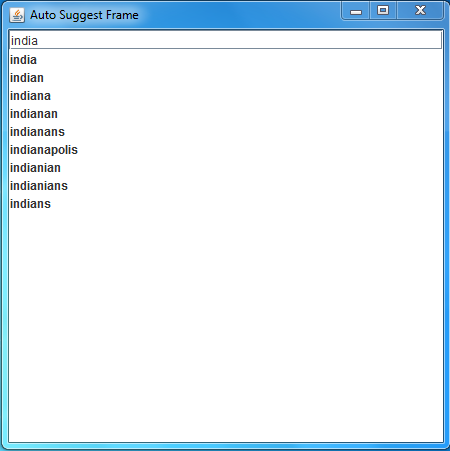
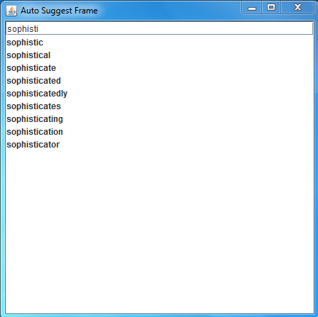

# Trie-AutoSuggestion
<html>
<body>
<h2>This AutoSuggestion Frame uses Trie data structure.All the words in the dictionary are retrieved and stored in a trie data structure.</h2>
<h2>Whenever a word is entered in the textfield of the frame,the entered string is considered as a prefix and all the words in the trie data structure having that prefix are retrieved out</h2>

<video width="400" height="400" controls="false" autoplay="autoplay">
<source src="Trie-AutoSuggestion/images/gv.mp4" type="video/mp4"/>
</video> 
</body>
</html>
